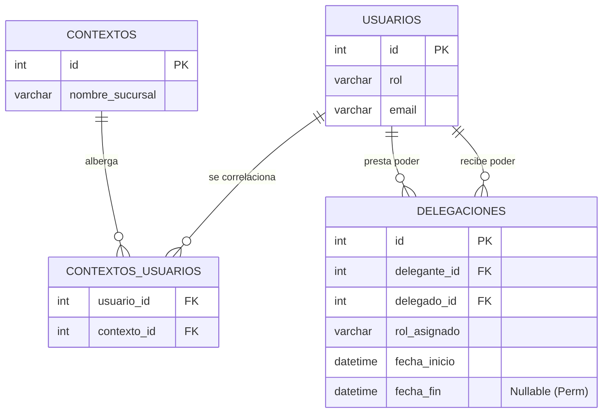
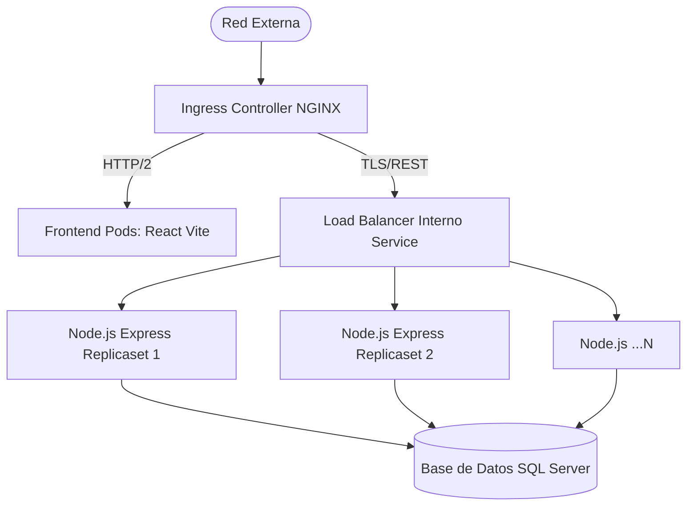

# Arquitectura General (TB Gestión ERP)

Este documento funge como el *Single Source of Truth* (SSOT) del diseño del sistema. El ecosistema es un Monolito Distribuido Multi-Tenant, regido orgánicamente por Express en Node.js, y servido globalmente a través de un Frontend encapsulado en Vite/React.

## Principios Multi-Tenant y Seguridad (RBAC)
Cada sucursal (Contexto) se aísla de las otras en una topología M:N, garantizando que el usuario solo opere en las franquicias a las que se le haya delegado el poder.

### Delegación Organizacional Temporal
Implementada en `v1.23.0`, esta tecnología permite a los perfiles Directivos traspasar un sub-rol (Ej: de Administrador a Supervisor Temporal) a cualquier usuario mediante la tabla puente.

## Despliegue del Clúster y Balanceo (Escalabilidad)
Para amortizar las cargas en `v1.22.0`, la topología migró a orquestación de Kubernetes.

La red maneja protección *OOM-Kill* limitando de manera estricta los ciclos de reloj de la CPU y la asignación nativa de la Memoria RAM. En caso de fallos por picos de facturación, K8s instanciará clústeres elásticos mediante *Horizontal Pod Autoscaler (HPA)*.
