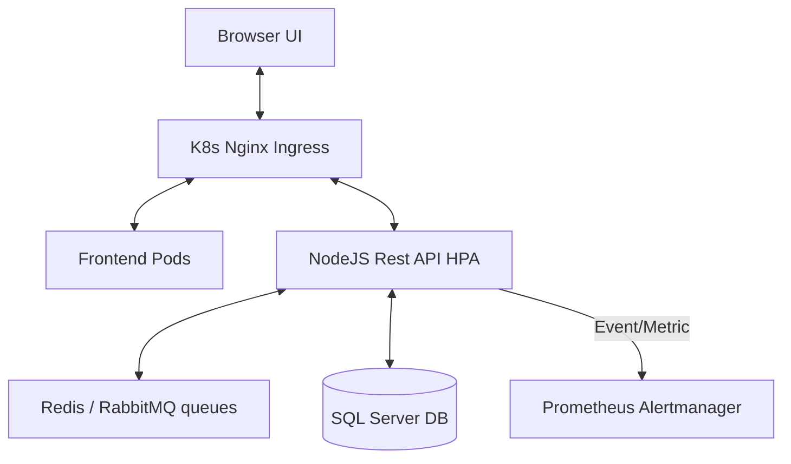

# Arquitectura del Sistema: TB Gestión ERP

## 1. Visión General
TB Gestión es un ERP robusto diseñado bajo principios de **Multi-Tenant** (Múltiples empresas) y **Multi-Contexto** (Múltiples sucursales por usuario). 
El backend opera mediante APIs RESTFUL en Node.js (Express), acoplado a un motor SQL Server transaccional. El frontend fue reconstruido en React.js (Vite) en un esquema de Single Page Application (SPA).

## 2. Abstracción Estructural y Nodos de Contexto

### Modelo de Seguridad (RBAC y Jerarquías)
El sistema emplea un Middleware híbrido de autorización:
1.  **JWT Tokens**: Al inicar sesión o pivotear de contexto (`PUT /api/v1/auth/contexto`), se firma el ID del tenant y de la sucursal operante.
2.  **Jerarquía de Roles (Delegación)**:
    -   `Admin`: Acceso omnisciente a todos los tenants creados. Delega libremente.
    -   `Gerente`: Acceso delimitado a un bloque Tenant. Máximo privilegio otorgable: *Supervisor*.
    -   `Supervisor / Vendedor / Cajero`: Operadores locales, incapacitados lógicamente para extender accesos a niveles superiores.

La persistencia N a N de contexto ocurre en la tabla `Contextos_Usuarios`, conectando a la fuerza laboral con disintos almacenes sin necesidad de múltiples credenciales.

## 3. Topología de Red y Escalabilidad (Kubernetes)
La aplicación cuenta con soporte nativo para despliegues masivos. Los manifiestos de Infraestructura como Código (`k8s/helm/stock-system`) dictan:

-   **Horizontal Pod Autoscaler (HPA)**: Monitorea activamente la carga de CPU/Memoria en el namespace del Backend. Si se experimenta un alza (ej. picos de facturación o importaciones CSV masivas), escala las réplicas automáticamente.
-   **Ingress Controller**: Balancea el tráfico C7 (HTTP/S) entrante entre los distintos Endpoints de los pods estáticos del frontend estático y el load balancer de Express.
-   **Contención Atómica por Rollback**: Respaldado por el pipeline CI/CD (`cd-pipeline.yml`), las nuevas releases K8S caídas son interceptadas vía Test de Humo, o bien por Alertas de Grafana/Prometheus (Tasa 5XX) las cuales triggeréan `./scripts/rollback.sh`.

## 4. Diagrama Lógico de Interacción

