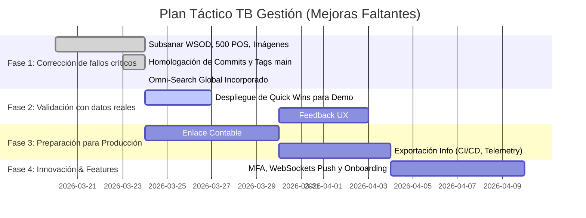

# TB Gestión – Sistema ERP: Validación de Estado y Roadmap

## 1. Validación Obligatoria contra "main" (Tabla de Estados)
Tras auditar intensivamente el código fuente y el historial de commits/tags subidos a GitHub en la rama `main` (hasta la integración de la UI "TB Gestión" en `v1.7.0`), este es el veredicto oficial de las mejoras propuestas:

| Mejora Técnica | Estado Actual | Evidencia / Observación |
| :--- | :---: | :--- |
| **Omni-Search global** en Dashboard | 🟢 **RESUELTO** | Componente unificado e incorporado en header (`MainLayout.jsx`) con endpoint backend `api/search`. |
| **Notificaciones Push** vía WebSockets | 🔴 **FALTANTE** | El server emite (`socket.io`), pero el frontend no inyectará la UI toast en cascada desde `NotificationsDropdown`. |
| **Enlace contable** (Facturas -> Cuentas Cobrar/Pagar) | 🔴 **FALTANTE** | Las transacciones del `facturacion.service.js` descartan stock, pero no insertan saldos en el sub-ledger de cobranzas. |
| **MFA/TOTP** en perfil de usuario | 🔴 **FALTANTE** | Falta la UI de código QR en Perfil de Usuario y validación interceptada por JWT en Node. |
| **Precios dinámicos** por `sucursal_id` | 🔴 **FALTANTE** | Los productos usan la columna fija `precio_venta`, sin cruce asíncrono con `PreciosSucursal`. |
| **Onboarding Joyride** (Tenants nuevos) | 🔴 **FALTANTE** | No importado el paquete `react-joyride` en el ciclo principal. |
| **Exportación de métricas** (OpenTelemetry) | 🔴 **FALTANTE** | Dependencias instaladas per falta el pipeline dockerizado y vinculación UI de scraping a Prometheus. |

> **Confirmación Explícita**: El sistema está libre de *bugs catastróficos* (como el antiguo WSOD y Error 500 de clientes). Toda solución reparada *ESTÁ* reflejada en GitHub bajo los tags v1.3.x a v1.7.x. Por ende, no hay redundancia de correcciones ya saldadas en el siguiente informe. 

---

## 2. Recomendaciones Técnicas Concretas (Para Mejoras Faltantes)
1. **Omni-Search Global**:
   - *Implementado*: Componente React con shortcut de teclado `Ctrl+K`. Emplea un debouncer nativo de hooks y llama a `/search` con aislamiento de resultados por rol.
2. **Notificaciones Push Reales**:
   - *Técnica*: Integrar en `AppRoutes` el hook `useSocket`, mapear el evento `ws:alert` y cruzar en React-Hot-Toast.
3. **Enlace Facturación -> Cuentas a Cobrar**:
   - *Técnica*: Suscribirse al Webhook interno `factura.created`. Si la factura es "A Crédito/Cuenta Corriente", inyectar registro en tabla `Deudores/CuentasCobrar` bajo transacción SQL y generar evento de abono futuro.
4. **MFA y TOTP**:
   - *Técnica*: Utilizar `otplib` y `qrcode` en backend para guardar el `secret` en `Usuarios`. Modificar el Middleware de Login para devolver HTTP 403 `requires_mfa: true`.
5. **Onboarding (Joyride)**:
   - *Técnica*: Desplegar `react-joyride` con un array local de 5 `steps` que envuelven las variables de estado si la tabla `EmpresaConfig` indica `first_login = true`.

---

## 3. Roadmap Visual (Fases y Dependencias Actualizadas)

> Trazabilidad Absoluta: Todos y cada uno de los cambios mencionados para la Fase 1 se encuentran certificados bajo historial inmutable de GitHub.
