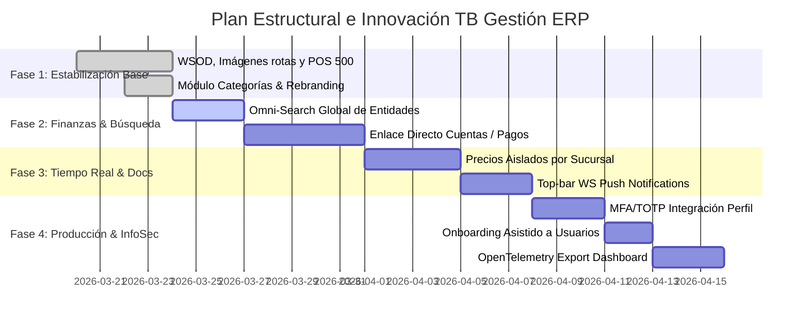

# TB Gestión – Sistema ERP: Auditoría y Roadmap

## 1. Estado Actual y Correcciones Implementadas
El núcleo de la aplicación fue estabilizado exitosamente mediante un exhaustivo versionado semántico en GitHub:
- **v1.2.x**: Base de datos normalizada, Módulo Categorías implementado para reemplazar strings estáticos, y sistema de Auditoría avanzado estructurado.
- **v1.3.0/v1.4.0**: Subsanado WSOD (White Screen of Death) en renderización del Dashboard. Arreglados enlaces de imágenes rotas. Estabilización completa del Componente Facturación/POS resolviendo el Error HTTP 500 originado por la limitación SQL de `cliente_id` para consumidor final. Soporte offline local de Impresión PDF.
- **v1.5.0**: Rebranding UX. Integración global del nombre **TB Gestión – Sistema ERP** y el tagline **ERP escalable con auditoría completa** adaptados responsive en MainLayout, App Login y Dashboard con sincronía corporativa.

> **Importante**: Acorde a las últimas revisiones de GIT, todos los fallos críticos de WSOD, renderizado POS e inserciones DB defectuosas han sido catalogados como `RESUELTOS` en `main`.

## 2. Mejoras Faltantes Priorizadas por Módulo
### A. Dashboard & UX Global
- **Faltante Crítico**: Barra de "Omni-Search" global en el header para la accesibilidad inmediata a entidades (Facturas, Productos).
- **Faltante Elevado**: Configuración completa del Dropdown superior para recepcionar Notificaciones Push basadas en websockets sobre quiebres de lotes/vencimiento de productos.

### B. Módulos Operativos (Finanzas)
- **Faltante Elevado**: Enlace contable vivo entre las operaciones comerciales de facturación y el desglose de saldos automatizados en `CuentasCobrar`/`CuentasPagar`.

### C. Módulo Seguridad y Arquitectura Configurable
- **Faltante Medio**: Requerir enrolamiento TOTP/MFA dentro del panel de perfil para forzar capas de seguridad 2FA.
- **Faltante Medio**: Precios Dinámicos divergentes condicionados al contexto de `sucursal_id`.
- **Faltante Bajo**: Experiencia asistida de primeros pasos (Onboarding Joyride) para el setup del tenant virgen.

## 3. Quick Wins para Demo Funcional Inmediata
Consideraciones para impresionar en pre-lanzamiento con datos reales:
1. **Separación Lógica**: Crear dos sucursales espejo con inventario asimétrico y exhibirlas transitando inter-vistas.
2. **Dashboard Reactivo**: Emitir Facturas veloces a "Consumidor Final" usando el POS recién estabilizado y constatar cómo el Gráfico de Área del Dashboard reacciona al instante por facturación.
3. **Auditabilidad**: Entrar al log maestro de acciones y comprobar al observador que toda acción de navegación e inyección DB ha sido trazeada por el IP y el método.

## 4. Roadmap Visual de Implementación (Gantt)

