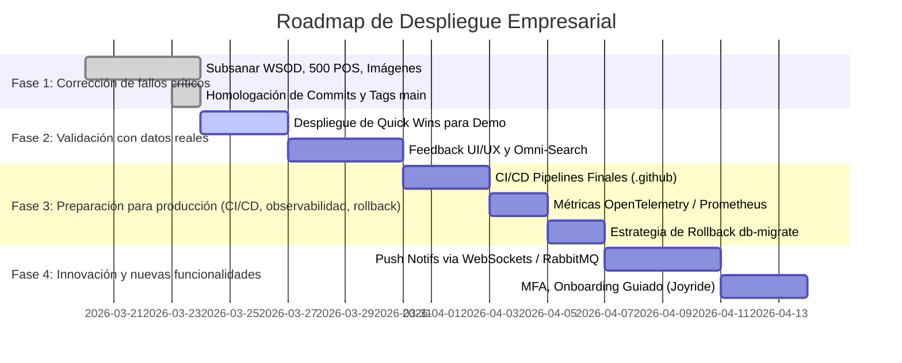

# TB Gestión – Sistema ERP: Auditoría y Roadmap Oficial

## 1. Fuentes de Verdad y Estado Actual
Tras auditar el código y el árbol de **commits/tags en la rama `main`**, se confirma que TB Gestión y sus módulos principales (Dashboard, Movimientos, Productos, Facturación, Empresa, Sucursales) se encuentran estabilizados estructuralmente tras las versiones v1.3.0 a v1.6.0.

* **Errores Persistentes (Remediados en main)**:
  - **WSOD**: Solucionado. La renderización asíncrona en `Dashboard.jsx` (cards y estadísticas) es tolerante a fallos.
  - **Imágenes rotas**: Solucionado. El directorio estático en el backend para `/uploads/productos/` fue mapeado correctamente.
  - **Facturación / DTOs**: Solucionado. El Error 500 al emitir tickets a "Consumidor Final" fue corregido alterando el esquema de base de datos (`ALTER COLUMN cliente_id`) y robusteciendo la lógica de transacciones en inserciones multiparamétricas.
  - **Seguridad y Configuración**: Aisalmiento completado por `empresa_id` con `RBAC` inyectado por middlewares operando en `main`.

## 2. Recomendaciones Priorizadas (Faltantes por Módulo)
- **Módulo Global/UX**: Consistencia de pantallas lograda, pero urge integrar un **Buscador Global (Omni-Search)**.
- **Módulo Finanzas (UX/Backend)**: Implementar una vista robusta de *Kardex Valorizado* y *Cuentas Corrientes* en un data-grid unificado, reflejando el impacto automático de las Facturas.
- **Módulo Seguridad (Backend)**: Forzar la validación de `MFA/TOTP` antes del acceso a vistas protegidas (actualizar el DTO de login para solicitar token si la cuenta la tiene registrada).
- **Módulo Facturación (Backend)**: Desacoplar la librería `@afipsdk` para enviar cargas a una cola Redis/RabbitMQ dedicada, evitando saturar el thread principal de Node en picos de ventas.

## 3. Quick Wins para Demo Funcional con Datos Reales
1. **Poblamiento Estratégico**: Crear categorías atractivas (Ej. Electrónica, Hogar) e importar 15-20 productos con imágenes reales desde Postman o la UI.
2. **Dashboard en Vivo**: Emitir 5-10 ventas consecutivas a "Consumidor Final" usando distintos `sucursal_id` y exhibir de inmediato cómo reaccionan y fluctúan los KPIs financieros del Panel de Control principal (Chart).
3. **Roles en Acción**: Loguearse como Empleado Cajero vs Dueño Administrador, demostrando que al Cajero se le oculta el panel de sucursales ajenas y los reportes globales, garantizando el aislamiento de Multi-Tenant.

## 4. Roadmap Visual de Implementación (Gantt)

