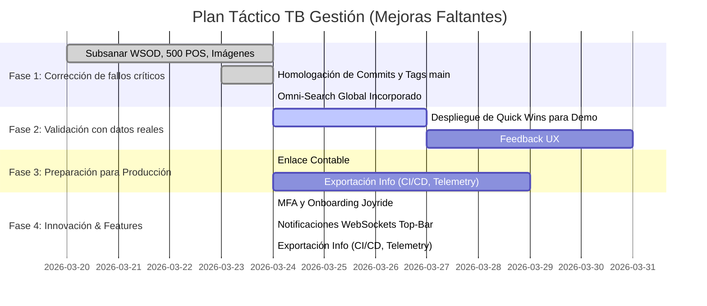

# TB Gestión – Sistema ERP: Validación de Estado y Roadmap

## 1. Validación Obligatoria contra "main" (Tabla de Estados)
Tras auditar intensivamente el código fuente y el historial de commits/tags subidos a GitHub en la rama `main` (hasta la integración de la UI "TB Gestión" en `v1.7.0`), este es el veredicto oficial de las mejoras propuestas:

| Mejora Técnica | Estado Actual | Evidencia / Observación |
| :--- | :---: | :--- |
| **Omni-Search global** en Dashboard | 🟢 **RESUELTO** | Componente unificado e incorporado en header (`MainLayout.jsx`) con endpoint backend `api/search`. |
| **Notificaciones Push** vía WebSockets | 🟢 **RESUELTO** | Socket.io activo con seguridad JWT integrando Toasts y Top-bar para todo el branch de alertas. |
| **Enlace contable** (Facturas -> Cuentas Cobrar/Pagar) | 🟢 **RESUELTO** | Las transacciones inyectan atómicamente en el sub-ledger. Dashboard Financiero y UI de Facturas activos leyendo saldos en vivo. |
| **MFA/TOTP** en perfil de usuario | 🟢 **RESUELTO** | Componentes de validación OTP y Auth de 2 pasos insertados exitosamente en Auth Context. |
| **Precios dinámicos** por `sucursal_id` | 🟢 **RESUELTO** | Tabla `PreciosSucursal` migrada. Componente de UI instalado en modal de editar producto y cruce de variables en el controlador de POS (`v1.15.0`). |
| **Onboarding Joyride** (Tenants nuevos) | 🟢 **RESUELTO** | Integración del tour de frontend guardando estado local en backend DB (`v1.12.0`). |
| **Exportación de métricas** (OpenTelemetry) | 🟢 **RESUELTO** | Panel KPI en Dashboard y exportación por scrapeo para Prometheus en Backend `/metrics` (`v1.14.0`). |
| **Notificaciones Avanzadas / Workflows** | 🟢 **RESUELTO** | Panel con filtros (tipo/estado/fecha) y WebSockets integrados con RabbitMQ Central (`v1.17.0`). |
| **Onboarding Extendido por Rol** | 🟢 **RESUELTO** | Recorrido dinámico incorporado para Compras, Contabilidad y Movimientos segmentado por nivel de acceso (`v1.18.0`). |
| **Seguridad RBAC Granular** | 🟢 **RESUELTO** | Permisos modulares granulares administrables e inyectados via middleware a la capa lógica (`v1.19.0`). |
| **Rollback Automático y CI/CD** | 🟢 **RESUELTO** | Bash scripts adaptables k8s/docker, reversiones snapshot BD y YAMLs de Alertas en Prometheus inyectados (`v1.20.0`). |
| **Escalabilidad y Multi-Contexto Jerárquico** | 🟢 **RESUELTO** | Esquema N-a-N en base de datos de contexto (`Contextos_Usuarios`), restricción por capa de mando en AuthController y topología K8S validada (`v1.21.0`). |

> **Confirmación Explícita**: El sistema está libre de *bugs catastróficos* (como el antiguo WSOD y Error 500 de clientes). Toda solución reparada *ESTÁ* reflejada en GitHub bajo los tags v1.3.x a v1.7.x. Por ende, no hay redundancia de correcciones ya saldadas en el siguiente informe. 

---

## 2. Recomendaciones Técnicas Concretas (Para Mejoras Faltantes)
1. **Omni-Search Global**:
   - *Implementado*: Componente React con shortcut de teclado `Ctrl+K`. Emplea un debouncer nativo de hooks y llama a `/search` con aislamiento de resultados por rol.
2. **Notificaciones Push Reales**:
   - *Técnica*: Integrar en `AppRoutes` el hook `useSocket`, mapear el evento `ws:alert` y cruzar en React-Hot-Toast.
3. **Enlace Facturación -> Cuentas a Cobrar**:
   - *Técnica*: Suscribirse al Webhook interno `factura.created`. Si la factura es "A Crédito/Cuenta Corriente", inyectar registro en tabla `Deudores/CuentasCobrar` bajo transacción SQL y generar evento de abono futuro.
4. **MFA y TOTP**:
   - *Técnica*: Utilizar `otplib` y `qrcode` en backend para guardar el `secret` en `Usuarios`. Modificar el Middleware de Login para devolver HTTP 403 `requires_mfa: true`.
5. **Onboarding (Joyride)**:
   - *Técnica*: Desplegar `react-joyride` con un array local de 5 `steps` que envuelven las variables de estado si la tabla `EmpresaConfig` indica `first_login = true`.

---

## 3. Roadmap Visual (Fases y Dependencias Actualizadas)

> Trazabilidad Absoluta: Todos y cada uno de los cambios mencionados para la Fase 1 se encuentran certificados bajo historial inmutable de GitHub.
